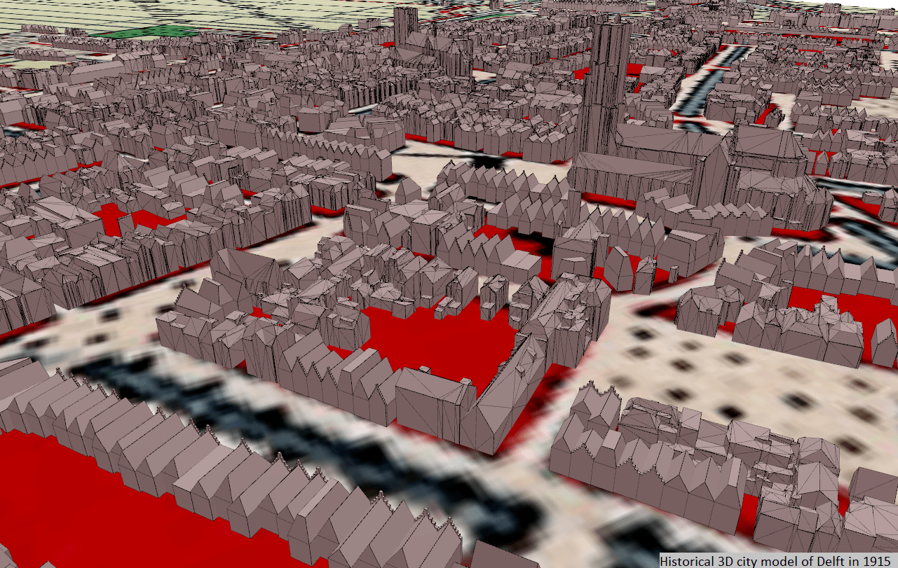

# Automatic reconstruction of 3D city models from historical maps 

This repository contains all the data that were used or output when reconstructing automatically 3D city models from historical maps in this [MSc thesis](http://resolver.tudelft.nl/uuid:0889e498-cdd6-4a19-bbcb-d3fb189560e1). The 3D city models reconstructed are made of 3D building models only and are _plausible_ historical 3D city models, i.e.  as  we  are  limited  by the amount of historical information available, they are based on educated  guesses  and  assumptions  in  order  to  infer 3D models that most likely match reality at a given moment in time. 

The  methodology  used to reconstruct these models consists  of  four  main  steps:  (1)  the  preparation  of the  historical  maps,  (2)  the  processing  of  the  historical maps  to  extract  the  building  plots,  (3)  the  subdivision  of these building plots into individual building footprints using two  different  alternatives  and  (4)  the  reconstruction  of  3D buildings from these building footprints. More details about the methodology workflow are available in the corresponding [MSc thesis](http://resolver.tudelft.nl/uuid:0889e498-cdd6-4a19-bbcb-d3fb189560e1) and the code to generate these datasets is available on the [other GitHub repository](https://github.com/camilleMorlighem/histo3d).  

## Data 

Each data folder contains input and output data that were used to implement the methodology for a specific historical map. Each folder is named by the city represented on its corresponding historical map and the date of the map (i.e. `<city name>_<map year>`). 

### Input data

Each folder contains one `input_data` subfolder with the following datasets: 
* `<city name>_<map year>` : historical map georeferenced in a _projected_ coordinate reference system (TIF file)
* `training_points_<city name>_<map year>` : training dataset made of training points (Shapefile). Each point is accompanied by its ID, the name of the class of features to which it belongs (string) and the label of the class (integer). Note that buildings belong to the `building` class, textual features belong to the `text` class and map symbols are part of the `symbol` class.  
* `ground_truth_<city name>_<map year>` : ground truth dataset made of points located inside the original building plots (one building plot <==> one point) (Shapefile). 
* `ground_truth_generalized_<city name>_<map year>` : ground truth dataset containing a subset of building plots manually digitalized from the input historical map. 

Note that ALL these datasets are georeferenced in the same _projected_ coordinate reference system. See the [MSc thesis](http://resolver.tudelft.nl/uuid:0889e498-cdd6-4a19-bbcb-d3fb189560e1) for more information about these data.

### Output data 
Each data folder `<city name>_<map year>` also contains three additional subfolders : (1) `building_plots_extraction`, (2) `plots_to_fp` and (3) `procedural_modelling`, which respectively contain the results of Step 2 (i.e. building plots extraction), Step 3 (i.e. reconstruction of individual building footprints) and Step 4 (i.e. reconstruction of 3D buildings). Interesting outputs are: 

* `building_plots_extraction\metrics_<city name>_<map year>.txt` : text file containing quality metrics (e.g. precision, recall, shape similarity and others) of the building plots extraction step. 
* `building_plots_extraction\metrics_<city name>_<map year>.csv` : csv file with a series of metrics (e.g. average area, average perimeter, average number of vertices and others) computed after the building plots extraction step. 
* `building_plots_extraction\final_plots_<city name>_<map year>.shp` : Shapefile with the building plots extracted from the historical map, vectorised and generalised. 
* `plots_to_fp\final_all_footprints.shp` : Shapefile with all the building footprints reconstructed from the building plots. 
* `procedural_modelling\histo_model_<city name>_<map year>.json` : final historical 3D city model reconstructed with the whole methodology workflow, stored as a CityJSON file.  
* `procedural_modelling\val3dity_report.json` : report from the val3dity validator. 
* `procedural_modelling\cjio_report.txt` : report from the cjio validator. 

## Study areas and years available 
Historical 3D city models have been reconstructed for two study areas at different time periods: 

* **Delft** : historical 3D city models were reconstructed for **1880**, **1915**, **1961** and **1982** from historical maps of the [TU Delft Library](https://heritage.tudelft.nl/en/objects/kaartenkamer-gidskaartjes/?id=4) and of the [topotijdreis website](https://www.topotijdreis.nl/). All data for Delft models are georeferenced in ESPG:28992 (EPSG:7415 for the 3D CRS). 
* **Brussels (bxls)** : historical 3D city models were reconstructed for **1700**, **1890** and **1924** from historical maps of the [French national digital library](https://gallica.bnf.fr/). All data for Brussels models are georeferenced in ESPG:31370 (EPSG:6190 for the 3D CRS). Note that "Brussels" name was abbreviated to "bxls" in the data names and folders. 

## Citation/credit 

When using these data in a scientific context, please cite the data source of the historical maps and the following paper : 

Morlighem, C., Labetski, A. & Ledoux, H. Reconstructing historical 3D city models. Urban Info 1, 11 (2022). https://doi.org/10.1007/s44212-022-00011-3
